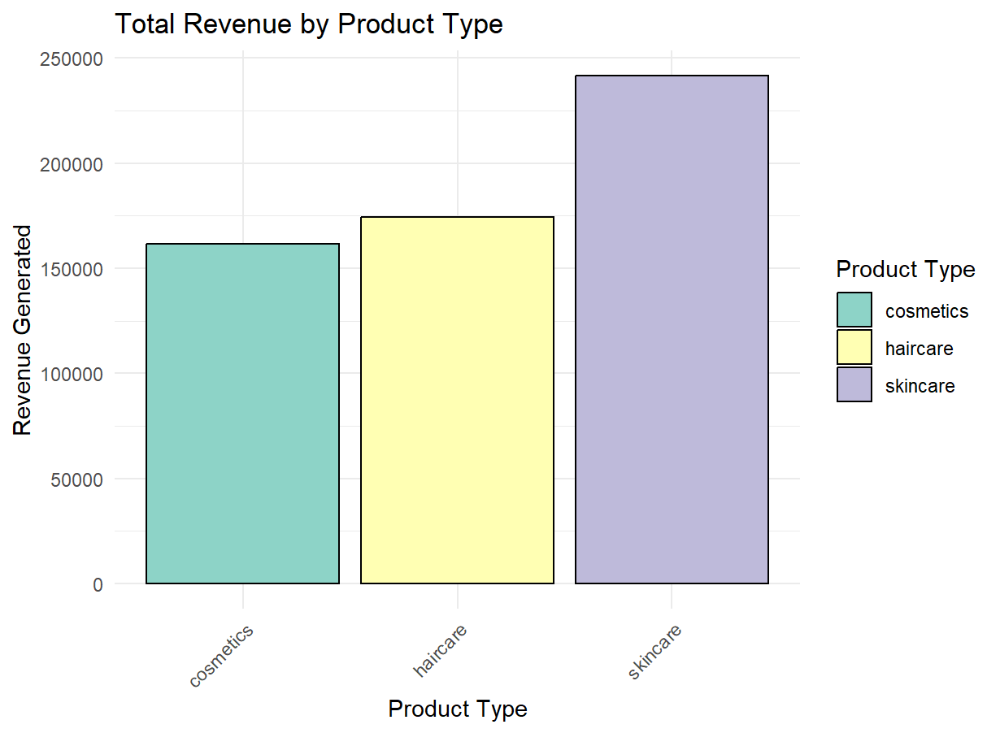

### This detailed analysis provides insights into the key metrics of a beauty startup, focusing on supply chain efficiency, sales performance, cost management, and quality control.

## SQL Findings

### 1. Total Revenue by Product Type

- **Highest Revenue:** Skincare with $241,628.17

### 2. Top Selling Products

- **Highest Units Sold:** SKU10 in Skincare with 996 units

### 3. Average Stock Levels by Product Type

- **Highest Average Stock Levels:** Cosmetics with 58.65 units

### 4. Average Lead Times

- **Highest Average Lead Time:** Suppliers with 17.08 days

### 5. Average Shipping Costs by Carrier

- **Highest Average Shipping Costs:** Carrier C with $5.60

### 6. Average Shipping Times by Carrier

- **Longest Shipping Times:** Carrier A with 6.14 days

### 7. Average Defect Rates by Supplier

- **Highest Average Defect Rate:** Supplier 5 with 2.67%

### 8. Average Manufacturing Costs by Product Type

- **Highest Average Manufacturing Costs:** Skincare with $48.99

### 9. Total Manufacturing Costs by Product Type

- **Highest Total Manufacturing Costs:** Skincare with $50,962.56

## R Analysis Results

### What is the total revenue by product type?

#### The revenue analysis reveals that Skincare products are the top performers, generating a substantial total revenue of $241,628.17, underscoring their strong market appeal and profitability. Haircare products also exhibit solid performance with a revenue of $174,455.42, reflecting their steady demand and market position. Meanwhile, Cosmetics products contribute approximately $161,521.27 in revenue, highlighting their significant role in the overall earnings and consistent consumer interest.

### What is the proportion of units sold by product type?

         

#### The distribution of units sold across product types reveals that Skincare represents 45% of the total units sold, indicating its leading role in the product lineup. Haircare follows with 29.5% of the units sold, reflecting its substantial contribution to overall sales. Cosmetics accounts for 25.5% of the units sold, highlighting its significant, though smaller, share of the market.

### What are the average lead times from different suppliers?

  

#### The analysis of average lead times reveals that Supplier 1 has an average lead time of approximately 15 days, indicating a relatively quick turnaround. Supplier 2 has a slightly longer average lead time of 18.3 days, while Supplier 3 experiences lead times a bit above 20 days, suggesting more extended processing times. Supplier 4 also shows an average lead time just above 15 days, comparable to Supplier 1. Finally, Supplier 5 has an average lead time of 18 days, placing it in a similar range as Supplier 2.

### What is the distribution of manufacturing costs by product type?

  

#### The box plot analysis of manufacturing costs reveals the following ranges for each product type. For Skincare, manufacturing costs range from around $15 to $80. Cosmetics exhibit costs ranging from approximately $23 to $59, while Haircare has costs that range from about $23 to $70. These ranges highlight the variability in manufacturing expenses across different product categories.

### What are the average shipping costs by carrier? 

  

#### The analysis of average shipping costs reveals that Carrier A has an average cost of $5.55, Carrier B is slightly lower at $5.51, and Carrier C has the highest average shipping cost at $5.60. This indicates a slight variation in shipping expenses among the carriers.

### What are the defect rates by supplier? 

  

#### The average defect rates for each supplier vary as follows: Supplier 1 has an average defect rate of 1.80%, indicating relatively low defect occurrences. Supplier 2 has a slightly higher defect rate of 2.36%, while Supplier 3 shows a defect rate of 2.47%. Supplier 4 reports an average defect rate of 2.34%, which is comparable to Supplier 2. Lastly, Supplier 5 has the highest defect rate at 2.67%, reflecting a higher frequency of defects compared to the other suppliers.

### What is the relationship between revenue and manufacturing costs by product type?

  

#### The analysis of the relationship between revenue and manufacturing costs by product type reveals distinct patterns. Skincare shows the highest total revenue at approximately $240,000, with manufacturing costs around $24,000. Haircare follows with a revenue of $174,455.42 and corresponding manufacturing costs of $17,446. Cosmetics generates $161,521.27 in revenue, with manufacturing costs of approximately $16,153.

#### A steady red line across the bars indicates the average manufacturing cost as a percentage of revenue. This line remains constant across the product types but grows steeper as it crosses the revenue bar for Skincare, suggesting that while the proportion of manufacturing cost to revenue remains steady, the actual cost impact becomes more significant as revenue increases.

### What are the correlations between key metrics such as revenue, number of products sold, manufacturing costs, lead time, and defect rates?

 

#### The correlation heat map reveals various relationships between key metrics. The correlation between lead time and revenue generated is negligible at -0.01, indicating almost no linear relationship. Similarly, defect rates and revenue generated have a weak negative correlation of -0.13. The correlation between lead time and defect rates is 0.30, suggesting a moderate positive relationship, where longer lead times are associated with higher defect rates. The relationship between number of products sold and revenue generated is 0.00, showing no linear correlation. Additionally, number of products sold and lead time have a minimal positive correlation of 0.04, while number of products sold and defect rates exhibit a slight negative correlation of -0.08. Manufacturing costs show a modest negative correlation with revenue generated at -0.21, indicating that higher manufacturing costs may be associated with lower revenue. The correlation between manufacturing costs and lead time is weakly negative at -0.12, and with defect rates, it is -0.01, showing minimal relationship. Lastly, the correlation between manufacturing costs and number of products sold is 0.03, reflecting a negligible positive relationship.

## Conclusion

#### In summary, the beauty startup analysis highlights key insights into various operational metrics. Skincare products lead with the highest total revenue and significant manufacturing costs, indicating their market strength and higher production expenses. Haircare and Cosmetics follow with solid performance and respective costs. The average lead times and shipping costs vary by supplier and carrier, respectively, impacting efficiency and expenses. The defect rates reveal that Supplier 5 has the highest rate, suggesting a need for quality improvements. The analysis of manufacturing costs in relation to revenue shows a steady proportion, with a more significant impact on revenue for higher-performing products. Correlation analysis indicates weak to moderate relationships between metrics, suggesting areas for further investigation to optimize performance and cost management.

